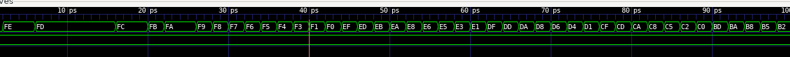

# Lab 2

## Task 1

The working model for the sine wave generator is working:

I unfortunately still don't have a laptop so can't run it on Vbuddy currently, but *definitely* will have one by next week, so will add all the Vbuddy integration things then.