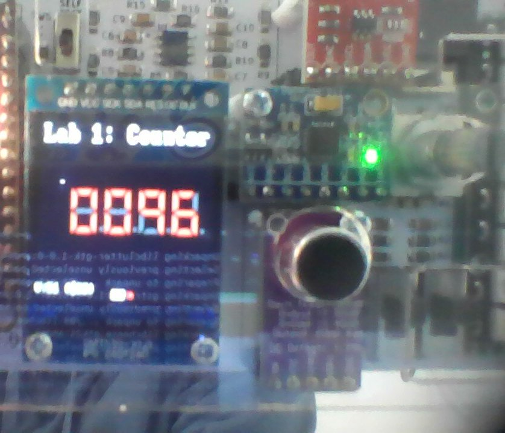

# Lab 1

## Task 1

GTKWave working:


### Test Yourself Challenges

After making the modifications, I don't see any changes other than the expected change in the value the counter reaches changing? I did also remove the RST conditions to allow the value to get high enough though... not sure. If there's a way of getting the current count value out of the model instead of just sending certain signals on predetermined clock cycles it would probably be easier to check these things, but currently I can't check if such a feature exists as my VSCode Intellisense is refusing to acknowledge the existence of any of the header files. I love Intellisense.

## Task 2

Got the counter running and displaying the value on the Vbuddy!



### Test Yourself Challenges

Made the requested modifications which pretty much just involved adding this line:
```systemverilog
logic [WIDTH - 1:0] increment = dir == 1'b0 ? {{WIDTH-1{1'b0}}, en} : {{WIDTH{en}}};
```
and then using `increment` as the value that gets added to count in the `always_ff` block. 

It works, and you can now plan budget Geometry Dash on the Vbuddy.

## Task 3

Got both step 1 and 2 done, viewable in seperate commits in [task 3](task3).

## Task 4

Vbuddy counts up when the button is pressed, displaying the result through binary coded decimal.