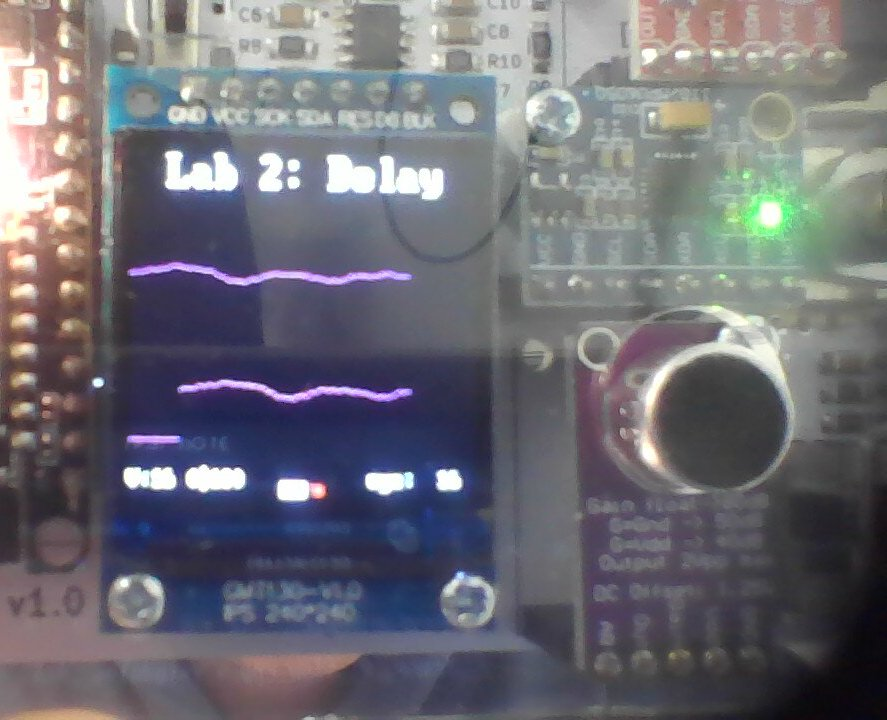

# Lab 2

## Task 1

The working model for the sine wave generator is working:

and is also working in person on the Vbuddy.

### Test Yourself Challenge

Setting the increment to the value provided by `vbdValue()` resulted in being able to change the frequency of the sine wave reliably up to a value of 16, after which the structure of the sine wave breaks down.

## Task 2

Both sine and cosine waves can be generated:

## Task 3

Everything works as required:

(`cyc` shows 16 as i set it to show the amount of cycles for delay that are being used)